# ChartMap EFB

ChartMap EFB is an electronic flight bag (EFB) for flight simulation, currently in active development. It connects to X-Plane over WebSocket telemetry and presents a moving map, live weather, the active flight plan, and a vertical flight profile in a layout inspired by professional airline EFBs. The application runs on a desktop computer, with an optional companion tablet on the same local network.

## Status

Early development, pre-release. Source code is not yet public.

## Screenshots

| | |
|---|---|
| 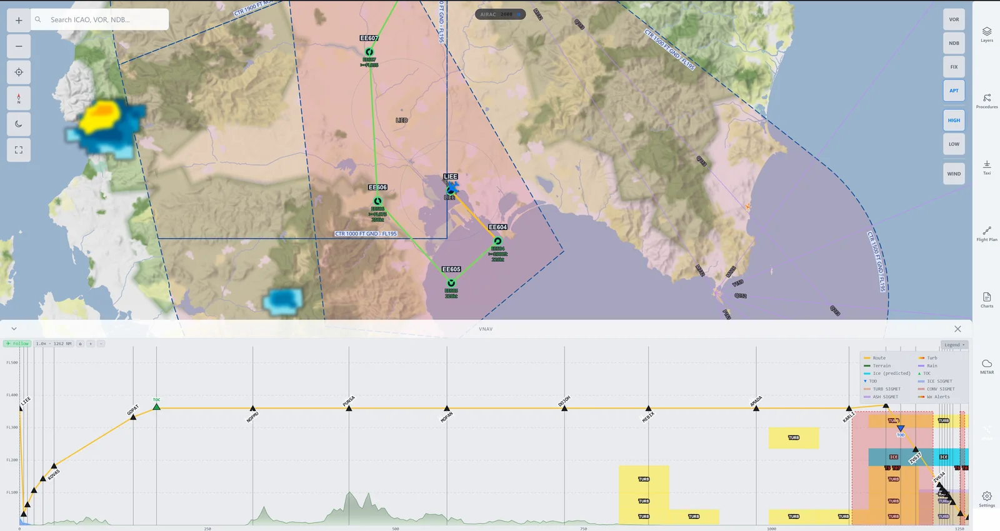 | 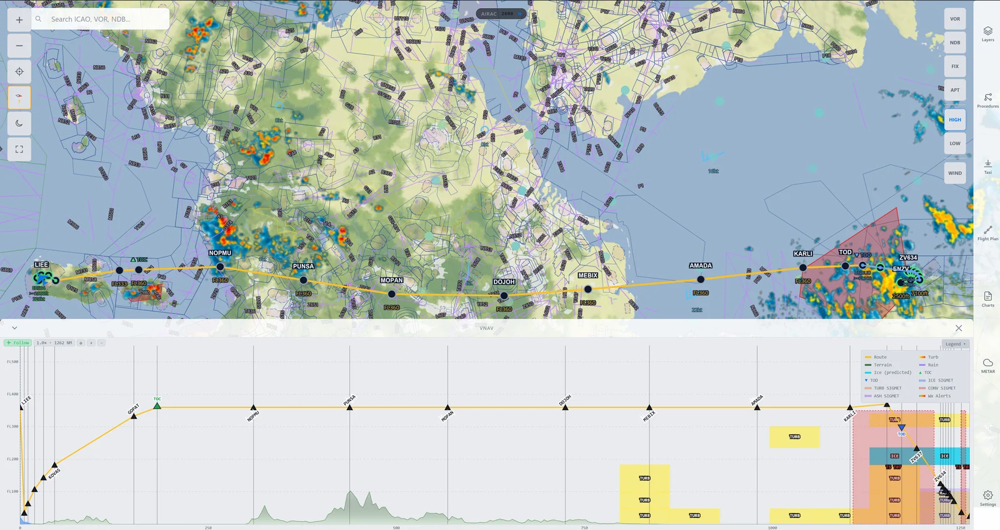 |
| Moving map with flight plan route | Weather layers on the moving map |
| 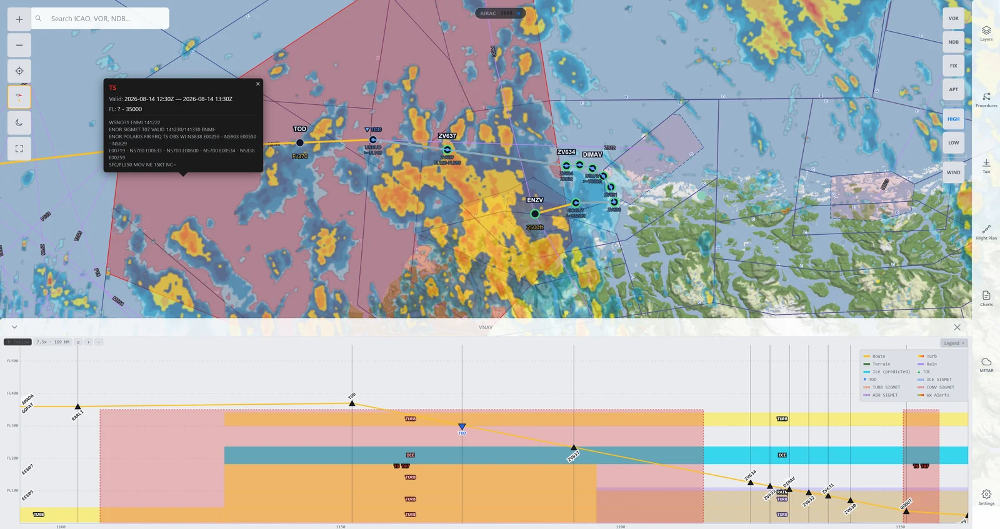 | 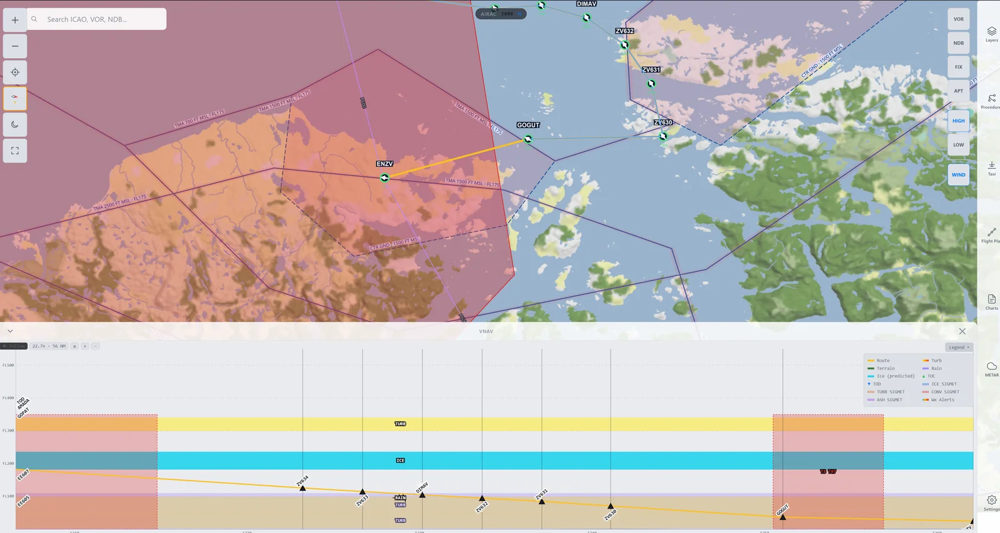 |
| Weather, airspace and traffic | VNAV vertical profile |
| 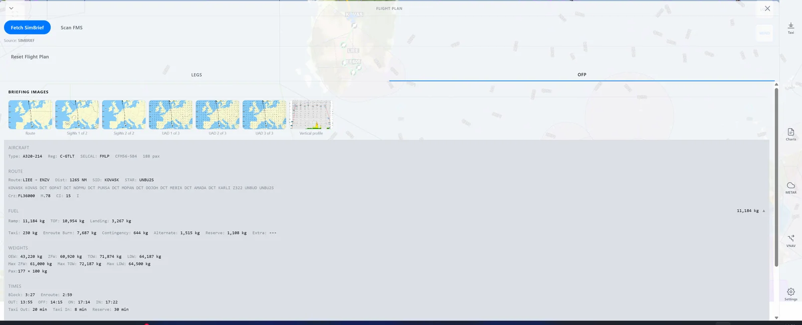 | 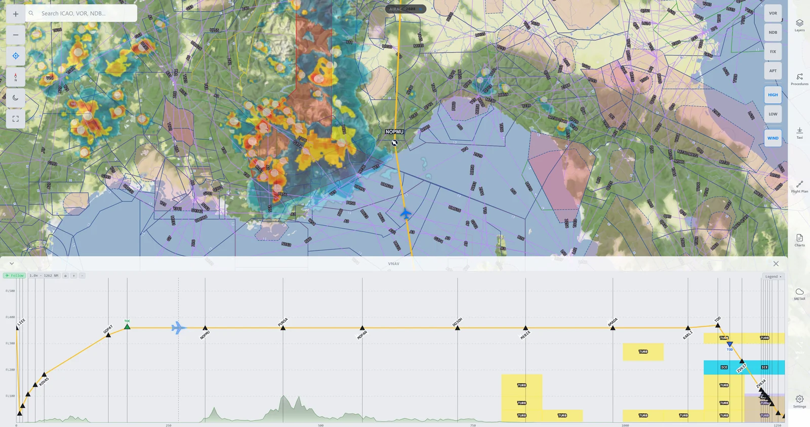 |
| VNAV profile with weather cross-section | VNAV profile, zoomed view |
| 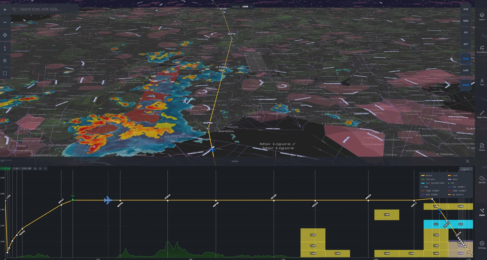 | 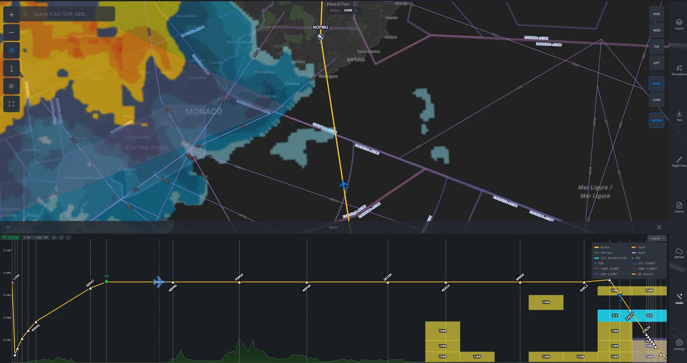 |
| VNAV profile with aircraft progress | Chart library |
| 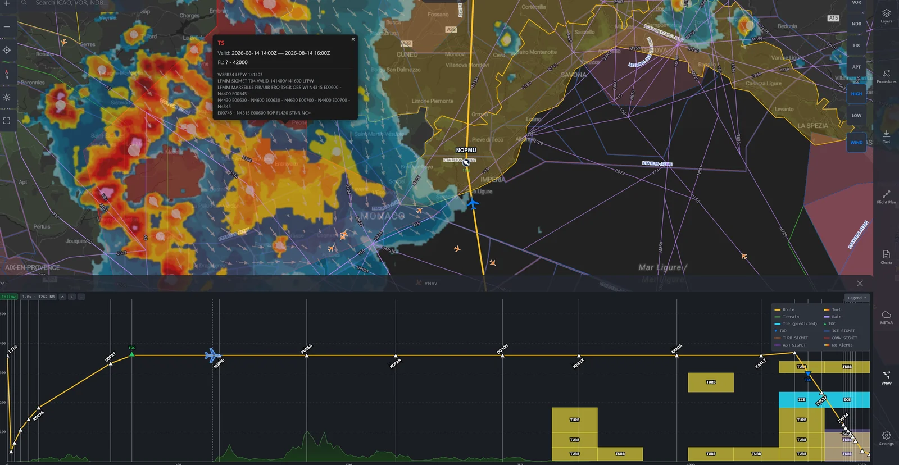 | 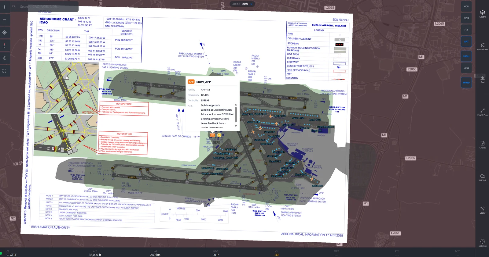 |
| Chart viewer | Chart georeferencing on the map |
| 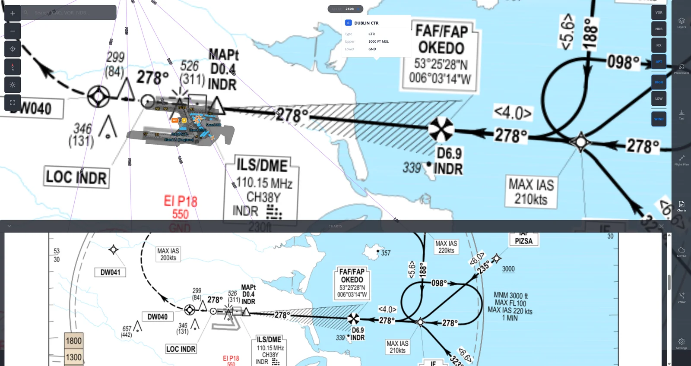 | 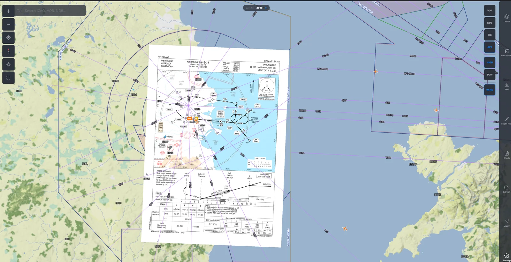 |
| Settings, flight plan sources | Settings, weather sources |
|  | |
| Settings, self-hosted weather | |

## Features

- Moving map with terrain, weather radar, winds aloft, turbulence, and SIGMET / G-AIRMET hazards (domestic and international, including Europe)
- Airspace display (OpenAIP, classes A-G with individual toggles)
- VATSIM integration: live traffic and ATC sector boundaries
- Flight planning: import from SimBrief or the FMS, Lido-style route rendering, automatic departure-airport handling
- VNAV vertical profile: terrain, stepped cruise and descent path, waypoint labels, TOC/TOD and step-climb markers, altitude constraints, distance and altitude axes, and a live weather cross-section drawn at real flight levels (turbulence, icing, rain columns, SIGMET hazard columns), with aircraft progress tracking, zoom, scroll and follow-aircraft modes
- Chart library: per-airport charts (airport diagrams, SIDs, STARs, approaches) from local PDFs, rendered to PNG with a built-in viewer and a two-point georeferencing workflow that overlays the chart on the moving map, plus opacity, brightness, rotation and offset fine-tuning
- Weather resilience: disk-backed cache and rate-limit cooldown so the application keeps serving the last good data during upstream outages; support for self-hosted sources (LibreWXR radar, Open-Meteo on ECMWF IFS data)
- Telemetry: 10 Hz live data from X-Plane

## Architecture

| Layer | Technology |
|-------|-----------|
| Desktop shell | Tauri (Rust) |
| Backend | Python, FastAPI |
| Frontend | Vue 3, TypeScript, MapLibre GL |
| Data sources | X-Plane WebSocket telemetry, SimBrief / FMS flight plans, NOAA AWC weather, Open-Meteo, RainViewer / LibreWXR radar, VATSIM |

## Roadmap

1. Online chart catalogue (ChartFox) with built-in georeferencing
2. Dispatch and OFP integration: NOTAMs, weather briefings, fuel and performance data
3. VATSIM data-link (CPDLC/ACARS via Hoppie) — evaluation
4. Public release

## Contact

Patrick Woodlock — pwoodlock@outlook.ie
